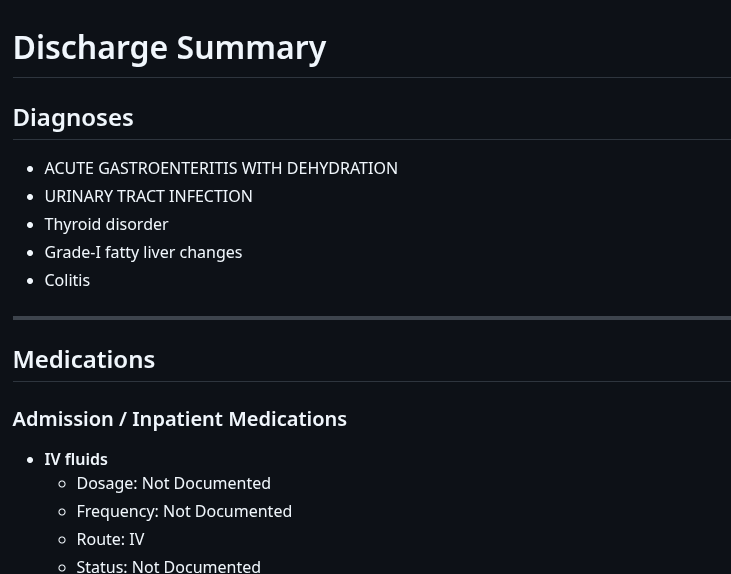
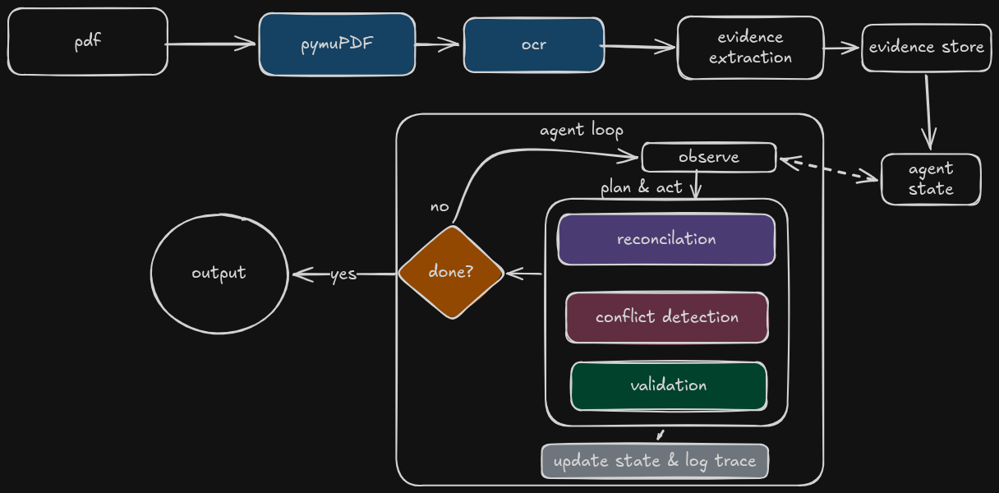
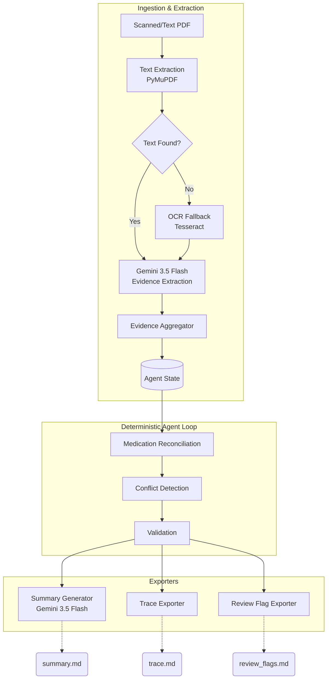
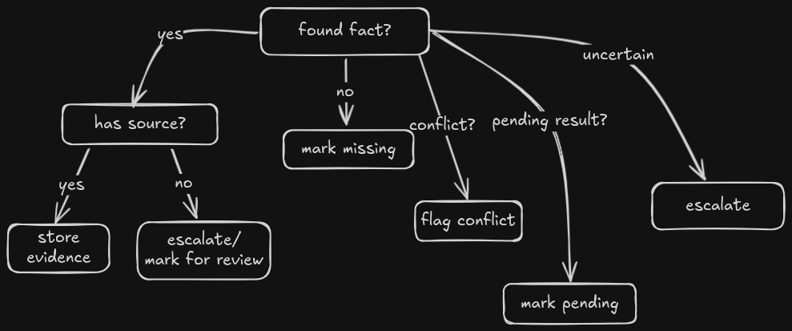

# Discharge Summary Generation Agent

An AI-powered clinical document processing system that converts scanned patient records into structured discharge summaries while preserving provenance, detecting conflicts, and surfacing uncertainty through review flags.

## Blog and Demo
[Blog Link](https://medium.com/@sparamveer1001/building-discharge-summary-agent-d98e65ba1c1f?postPublishedType=initial)
[Demo Link](https://youtu.be/gpuAX_5j37s)


## Key Features

- OCR support for scanned PDFs
- Structured evidence extraction
- Medication reconciliation
- Conflict detection
- Validation layer
- Agent-based workflow
- Explainable execution traces
- Safe summary generation

## Problem

Clinical discharge summaries are often created from fragmented patient records containing:

- Scanned documents
- OCR noise
- Missing information
- Conflicting information
- Medication changes
- Pending test results

A naïve PDF → LLM approach can hallucinate information and provide limited explainability.

This project uses a multi-stage agent architecture to improve safety, traceability, and reliability.

## Architecture & Flow Diagram

The pipeline operates in two distinct phases: **Ingestion & Extraction** and the **Deterministic Agent Loop**.





## Agent Workflow

The agent follows an Observe → Plan → Act → Update → Repeat loop.

1. Observe current state
2. Determine highest-priority unfinished task
3. Execute selected tool
4. Update state
5. Record execution trace
6. Repeat until complete



## Safety Principles


### Unknown > Wrong

The system never fabricates clinical information.

Missing information is rendered as:

"Not Documented"

instead of guessed values.

### Conflict Preservation

When contradictory information is detected:

- The conflict is preserved
- A review flag is created
- The system never chooses a winner

### Provenance

Every extracted fact stores:

- Source page
- Source document
- Source text

allowing full traceability.

## Features

- **Provenance Tracking**: Every extracted clinical fact (Diagnoses, Medications, Allergies, Procedures, Pending Results) maintains strict provenance tracking down to the exact `source_text` snippet, `source_document`, and `page_number`.
- **OCR Fallback**: Automatically renders pages missing native text to images and runs Tesseract OCR.
- **Deterministic Reconciliation**: Evaluates admission vs. discharge medications via deterministic grouping. Flags missing discharge statuses and newly prescribed medications.
- **Deterministic Conflict Detection**: Highlights contradictions (e.g., mismatched dosage/frequencies for the same medication) without autonomously overriding either.
- **Trace Logging**: Exports a chronological execution trace for maximum debugging visibility.

## Why an Agent even for this use-case?

Instead of:

PDF → LLM → Summary

the system separates responsibilities:

- Extraction
- Aggregation
- Reconciliation
- Conflict Detection
- Validation
- Summary Generation

This improves:

- Explainability
- Reliability
- Debuggability
- Safety

## Tech Stack

| Component | Technology |
|------------|------------|
| OCR | Tesseract |
| PDF Parsing | PyMuPDF |
| LLM | Gemini |
| Validation | Python |
| Agent | Custom Planner + Executor |
| Models | Pydantic |

## Repository Structure

```text
dischargeSummary-agent/
├── agent/                  # Deterministic pipeline planning and execution loop
├── extraction/             # Gemini-based clinical entity extraction (prompt engineering)
├── ingestion/              # PyMuPDF and Tesseract OCR document processing
├── outputs/                # Generators and exporters for final markdown deliverables
├── schemas/                # Pydantic models (Evidence, Page, AgentState, ReviewFlag)
├── tools/                  # Deterministic clinical tools (Reconciliation, Validation, Conflict)
├── tests/                  # Unit and integration test coverage
├── main.py                 # Core execution entry point
└── requirements.txt        # Python dependencies
```

## Example Summary


## Example Review Flags


## Example Agent Trace


## Future Improvements

- Mistral OCR integration
- Clinical terminology normalization
- Human-in-the-loop review UI
- Multi-patient batch processing
- Vector search for evidence retrieval
- LangGraph-based orchestration

## Setup & Installation

1. **Clone the repository:**
   ```bash
   git clone <your-repo-url>
   cd dischargeSummary-agent
   ```

2. **Install system dependencies (for OCR):**
   Ensure `tesseract-ocr` is installed on your OS.
   - Ubuntu/Debian: `sudo apt install tesseract-ocr`
   - MacOS: `brew install tesseract`

3. **Create a virtual environment and install packages:**
   ```bash
   python -m venv .venv
   source .venv/bin/activate
   pip install -r requirements.txt
   ```

4. **Configure Environment Variables:**
   The extraction and summary generation modules require a Gemini API key.
   ```bash
   export GEMINI_API_KEY="your_api_key_here"
   ```

## Usage

To execute the entire pipeline on a patient PDF document, simply run:

```bash
python main.py path/to/patient_record.pdf
```

### Outputs Generated

Upon completion, the pipeline will generate three files in the current working directory:

1. **`summary.md`**: The drafted clinical discharge summary based *strictly* on validated evidence.
2. **`trace.md`**: A chronologic system execution log denoting every tool executed and max-step constraints checked.
3. **`review_flags.md`**: A critical file for clinicians containing flags for missing fields, missing medications, and contradictory evidence discovered within the PDF.

## Engineering Constraints

- Pydantic models rigorously type the state.
- The `Agent Loop` uses a deterministic planner with a maximum step limit (`MAX_STEPS = 10`) to guarantee system stability and prevent infinite loops.
- `google-generativeai` LLM usage is constrained *strictly* to initial extraction and final markdown drafting. All reconciliation and conflict detection are written in standard Python.
